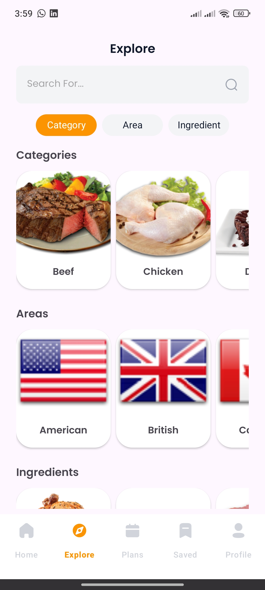

# Meal Master 1.0

MealMaster is a simple and efficient food planning app that helps users discover, save, and organize meals. Plan your meals, watch recipe videos, and access saved meals even offline!

Available on MediaFire Store and soon also on Google Play.

## Screenshots

   
   
   
   
  
  
  
  

### 🧑🏻‍💻 Android development

- Application is written with [Java](https://docs.oracle.com/en/java/)
- UI is written using [XML](https://www.w3schools.com/xml/xml_whatis.asp)
- Following the [Material You](https://m3.material.io/) guidelines
- Reactive Programming using [RXJava](https://reactivex.io/documentation)
- Database using [Room](https://developer.android.com/topic/libraries/architecture/room)
- Architectural pattern using [MVP](https://en.wikipedia.org/wiki/Model%E2%80%93view%E2%80%93presenter)
- Authentication and Backup by [Firebase](https://firebase.google.com/docs/)

### Features ✨

- Comprehensive Authentication System (Email/Password, Google, Guest)
- Advanced Meal Search by country, ingredient, and category
- Discover a Wide Variety of Meals from different categories, regions, and ingredients
- Detailed Meal Insights with full recipes and video tutorials
- Save Meals for Offline Access anytime, anywhere
- Plan Your Meals and schedule them for later preparation
- Sync & Backup Data to restore preferences and saved meals upon login
- Full Offline Mode Support for seamless usage
  

## Find this repository useful? :heart:
Support it by putting a star for this repository. :star:  
Also, __[follow me](https://github.com/3wiida)__ on GitHub for my next creations! 🤩
